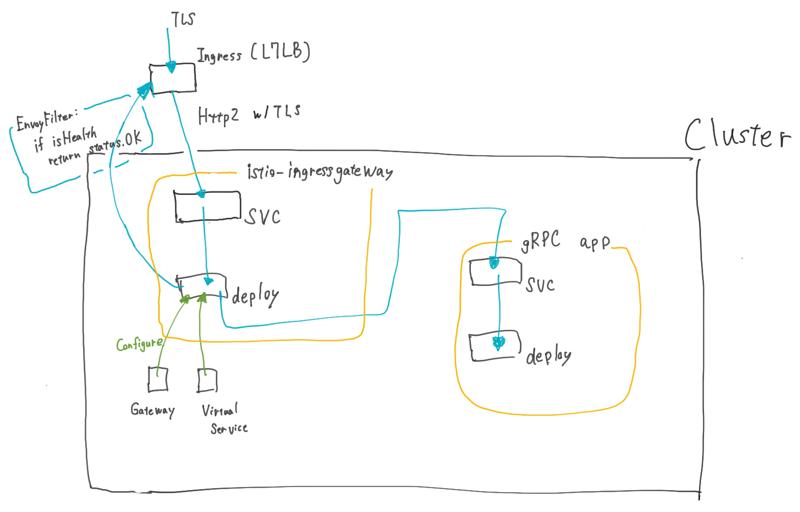

# Istio-w-L7LB

A sample of GCP ELB in front of istio ingress gateway with HTTP/2(gRPC)

## Components

This sample is tested in the following conditions:

* Kubernetes: 1.15.9-gke.24
* Istio: 1.5.2
* gRPC app: [soichisumi0/grpc-echo-server:v0.1.3](https://github.com/soichisumi/grpc-echo-server)

## Architecture

## Try this sample

0. Create cluster
1. Generate and deploy self-signed certificate
   1. `make gen-privkey`
   2. `make gen-csr`
   3. `make gen-cert`
   4. `make create-secret-for-ingressgateway`
2. Install istio
   * `make istio-install`
3. Deploy apps
   * `kubectl apply -f 2-pass-gce-ingress-health-check-w-tls/`
4. Do request
   * `grpcurl -d '{"message": "yo test message"}' -insecure $INGRESS_IP:443 grpctesting.EchoService/Echo`